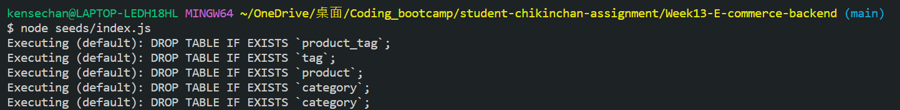
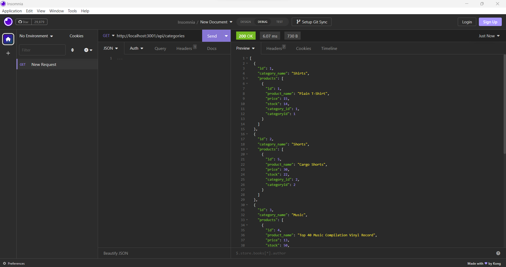
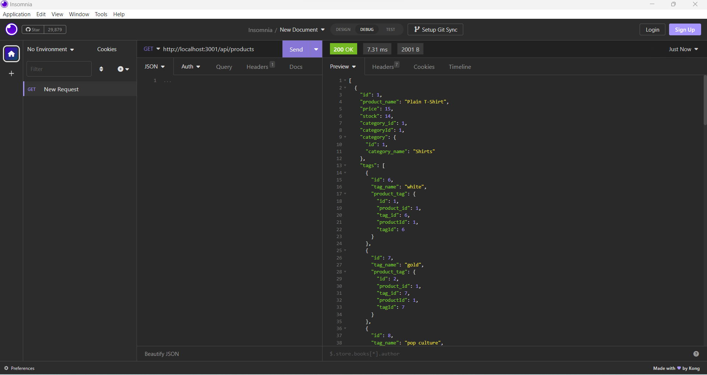
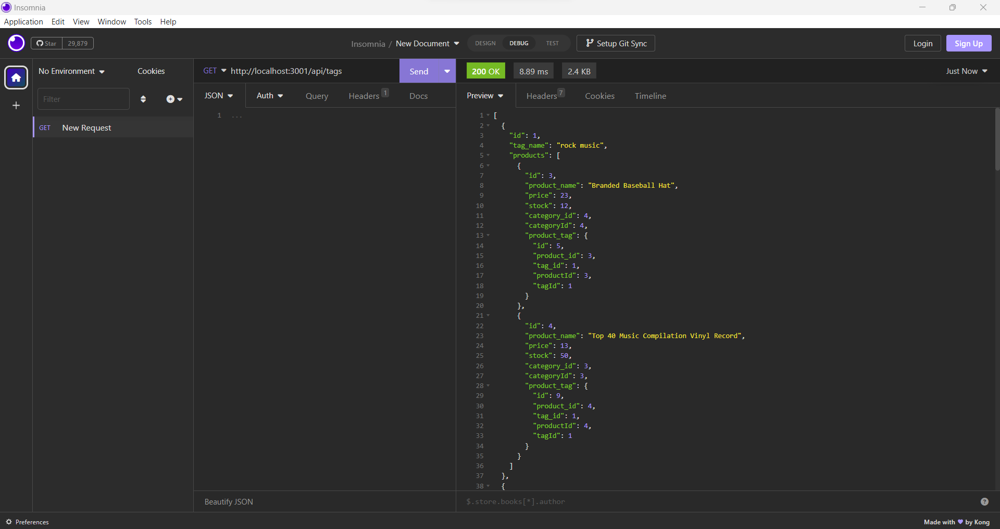
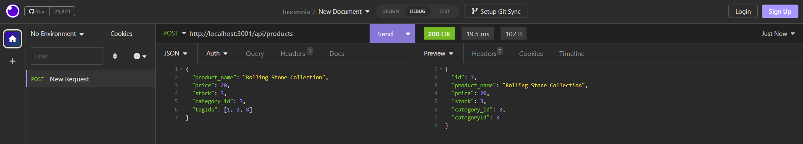
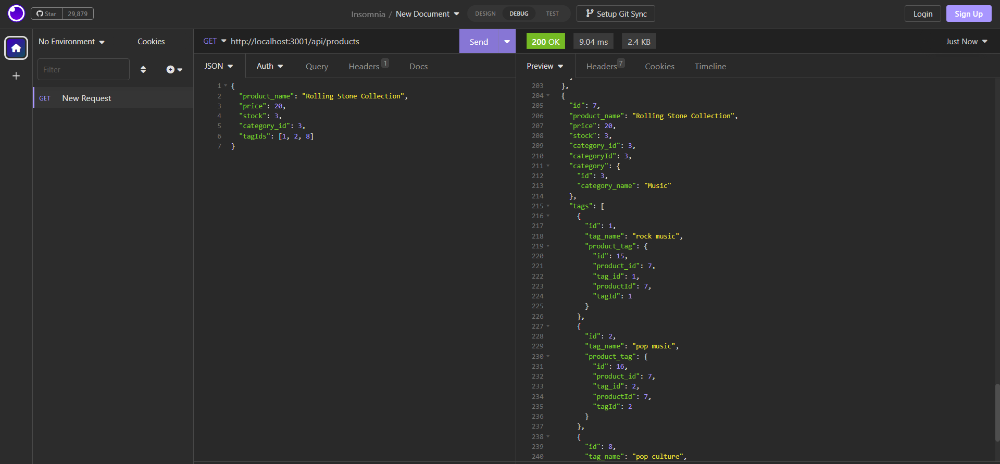
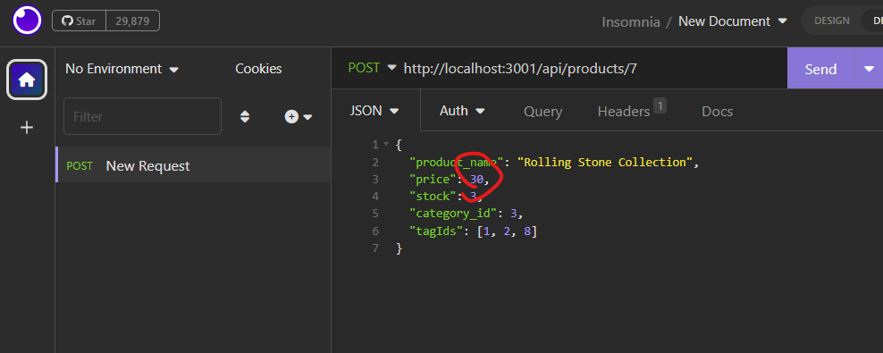
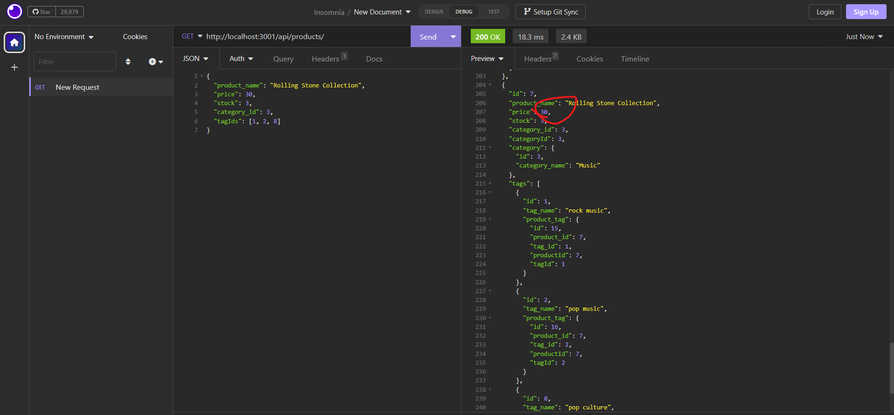
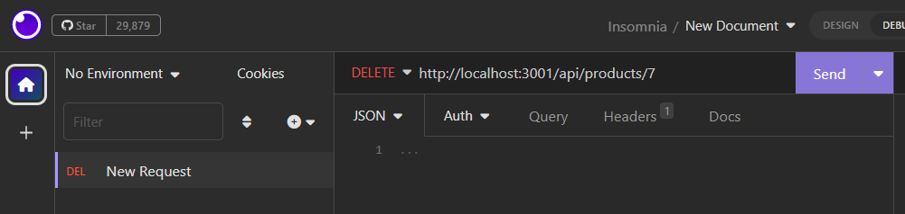
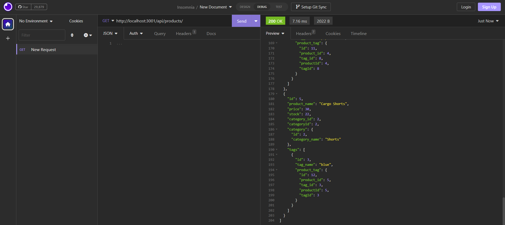

# E-commerce Back End

My challenge is to build the back end for an e-commerce site. I’ll take a working Express.js API and configure it to use Sequelize to interact with a MySQL database.

Because this application won’t be deployed, I’ll also create a walkthrough video that demonstrates its functionality and all of the following acceptance criteria being met. I’ll need to submit a link to the video and add it to the README of my project.

## Functions

- When I add my database name, MySQL username, and MySQL password to an environment variable file, then I am able to connect to a database using Sequelize.
- When I enter schema and seed commands, then a development database is created and is seeded with test data.
- When I enter the command to invoke the application, then my server is started and the Sequelize models are synced to the MySQL database.
- When I open API GET routes in postman Core for categories, products, or tags, then the data for each of these routes is displayed in a formatted JSON.
- When I test API POST, PUT, and DELETE routes in postman Core, then I am able to successfully create, update, and delete data in my database.

## Installation

- Go to an empty folder and type 'git clone https://github.com/cckinwest/Week13-Ecommerce.git' in the terminal to pull all the folders and files of the app.
- Type 'npm i' to install all packages required.
- Type 'nodemon server.js' to run the app server.

## Database

- Set up the database by first entering mysql by entering 'mysql -u root -p' and then the password.\
  

- Enter 'source db/schema.sql' to set up the database.\
  

- quit mysql, seed the data.\
  

- start the app by typing 'nodemon server.js' in the terminal.\
  

## Get Method

- When I open the 'GET' for categories, products, or tags, then the data for each of these routes is displayed in a formatted JSON.

  Category get:\
  

  Product get:\
  

  Tag get:\
  

## Post Method

When I open the 'POST' for categories, products, or tags, and input the body of the information of the item, then new item is created after the request. I show 'POST' for products as an examples.

- Go to the post of products route, type in the details of the products as body.

- Then go back to the GET to confirm that the new product is created.

It's similar for categories and tags so I don't show one by one.

## PUT Method

When I open the 'PUT' for categories, products, or tags, and specify the id of the item that needs to be updated, and the body of information that needed to be updated, then the item with that id is updated after the request. I show 'PUT' for products as an examples.

- Go to the put of products route (don't forget the product id), type in the details of the products as body.

- Then go back to the GET to confirm that the product is updated.

## Delete Method

When I open the 'DELETE' for categories, products, or tags, and specify the id of the item that needs to be deleted, then the item with that id is deleted after the request. I show 'PUT' for products as an examples.

- Go to the delete of products route (don't forget the product id).

- Then go back to the GET to confirm that the product is deleted.

## Deployment

The link is: [E-commerce-backend](https://github.com/cckinwest/Week13-Ecommerce)

The demo is: [Demo](https://drive.google.com/file/d/1jsWY8cxVyFI3C6dHsltou1AQzzDP0nPN/view)
